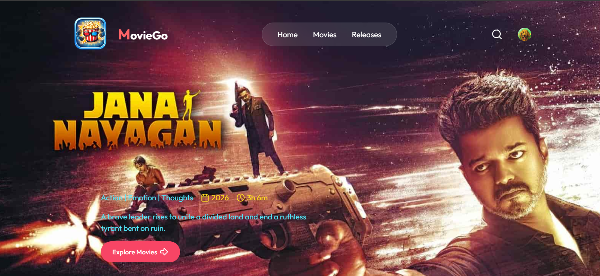

# 🎬 MovieGo – Movie Ticket Booking Platform

MovieGo is a full-stack web application that allows users to browse movies, book tickets, manage favorites, and receive notifications about new shows. It is built using the MERN stack with modern authentication, background jobs, and a responsive UI.

🔗 Live Demo: https://moviegofrontend.vercel.app/

---

### Application Preview

---

## 🚀 Features

- 🔐 Secure user authentication using Clerk
- 🎥 Browse and view movie details
- 🎟️ Book movie tickets online
- ❤️ Add and manage favorite movies
- 📩 Email notifications for new shows (via Inngest)
- ⏱️ Automatic seat release for unpaid bookings
- 📱 Fully responsive design with Tailwind CSS
- ⚡ Fast and scalable backend APIs
- 📊 Admin dashboard
- 📈 Analytics dashboard

---

## 🛠️ Tech Stack

### Frontend
- React.js
- Tailwind CSS
- Axios
- Vercel (Deployment)

### Backend
- Node.js
- Express.js
- MongoDB
- Mongoose
- Inngest (Background Jobs)

### Authentication
- Clerk

### Database
- MongoDB Atlas

---

## 🔐 Authentication (Clerk)

**Clerk handles:**

- User sign up / login
- Session management
- User metadata
- Secure API access
- Make sure your Clerk keys are properly configured in both frontend and backend.

---

## 🌐 Deployment
### Frontend

Deployed on Vercel

### Backend

Deployed on Vercel

---

## 🤝 Contributing
- Contributions are welcome!
- Fork the project
- Create a new branch
- Commit your changes
- Push to your branch
- Open a Pull Request

## 📄 License
This project is licensed under the MIT License.

## 👨‍💻 Developer
**Shakthivel K**  
Full Stack Developer  
MERN Enthusiast  
